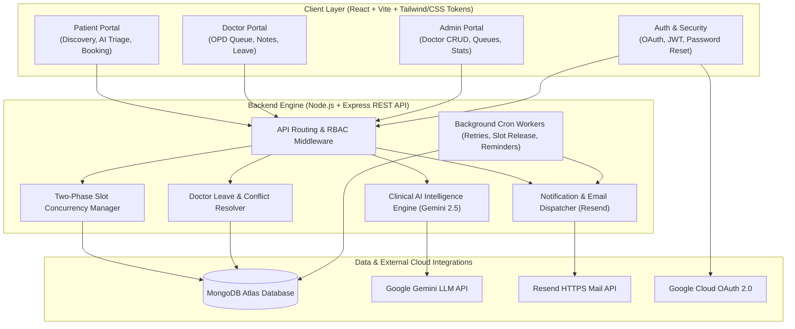

# ⚡ HealthSync — Intelligent Healthcare Appointment & Clinical AI Ecosystem

[](https://health-care-appoinment-ecosystem.vercel.app)
[](https://healthsync-api-yqrn.onrender.com)
[](https://ai.google.dev/)
[](https://resend.com)
[](https://github.com/harshit22oct-lang/health-care-appoinment-ecosystem/blob/main/SYSTEM_DESIGN.md)

> **HealthSync** is an enterprise-grade healthcare appointment orchestration platform and clinical intelligence ecosystem. Built with high-concurrency atomic slot locking, role-based portals (Patient, Doctor, Admin), Google Gemini AI clinical triage, Stripe-level transactional emails via Resend, and automated Google Calendar synchronization.

---

## 🌐 Production Deployments & Live Portals

| Service | Environment | Live Production URL |
|---|---|---|
| 🏥 **Patient & Public Web Portal** | Vercel (Edge CDN) | **[https://health-care-appoinment-ecosystem.vercel.app](https://health-care-appoinment-ecosystem.vercel.app)** |
| ⚡ **Healthcare API & Background Engine** | Render (Node.js 20+) | **[https://healthsync-api-yqrn.onrender.com](https://healthsync-api-yqrn.onrender.com)** |
| 🩺 **Doctor Specialist Directory** | Vercel | **[https://health-care-appoinment-ecosystem.vercel.app/patient/doctors](https://health-care-appoinment-ecosystem.vercel.app/patient/doctors)** |
| 🔐 **Interactive Sign In & Demo Access** | Vercel | **[https://health-care-appoinment-ecosystem.vercel.app/login](https://health-care-appoinment-ecosystem.vercel.app/login)** |
| 🔑 **Email Password Reset System** | Vercel | **[https://health-care-appoinment-ecosystem.vercel.app/forgot-password](https://health-care-appoinment-ecosystem.vercel.app/forgot-password)** |
| 📦 **Clean Source Code Submission** | Root Archive | [`Healthcare_Appointment_Ecosystem_SourceCode.zip`](https://github.com/harshit22oct-lang/health-care-appoinment-ecosystem/blob/main/Healthcare_Appointment_Ecosystem_SourceCode.zip) |
| 📐 **800-Word System Design Write-Up** | Architecture Document | [`SYSTEM_DESIGN.md`](https://github.com/harshit22oct-lang/health-care-appoinment-ecosystem/blob/main/SYSTEM_DESIGN.md) |

---

## 🔑 1-Click Evaluation Credentials

You can log in instantly via **1-Click Demo Badges** on the login page or using these verified accounts:

| Role | Email | Password | Access Scope |
|---|---|---|---|
| **Patient** | `rohan@patient.demo` | `Patient@123456` | Search doctors, book appointments, AI symptoms triage, digital prescriptions |
| **Doctor** | `dr.priya@healthsync.demo` | `Doctor@123456` | OPD queue, clinical notes, medication prescription, leave manager |
| **Admin** | `admin@healthsync.demo` | `Admin@123456` | Doctor profile CRUD, slot durations, system health, notification queues |
| **Google Sign-In** | Any Google Account | OAuth 2.0 | Instant 1-click Google OAuth verification & profile auto-hydration |

---

## 💎 Product Feature Catalog & Architecture

### 1. 🧠 Multipurpose AI Search & Universal Indian City Intelligence
* **Dynamic Location & Facility Resolution**: Users can search natural language queries such as `"medical shop in katihar"`, `"cardiologist in ranchi"`, or `"doctors in chennai"`.
* **Universal City Extraction**: Automatically detects any Indian town or city, switches the active locality context, and fetches real-world verified clinics, hospitals, and pharmacies.
* **Medicine & Pharmacology Advisor**: Queries for medications (e.g. *Paracetamol, Azithromycin 500mg, Metformin*) are parsed to explain clinical usage, dosages, and relevant specialist matching.

### 2. 🔒 Two-Phase Atomic Slot Hold (Zero Double-Booking Guarantee)
* **Concurrency Protection**: Eliminates race conditions when multiple patients attempt to book the same slot simultaneously.
* **Atomic State Transition**: `AVAILABLE` ➡️ `HELD (with UUID hold token + 5-min TTL)` ➡️ `CONFIRMED`.
* **Automatic Expiration Reversion**: High-performance background cron worker releases orphaned holds after 300 seconds.

### 3. 🤖 Google Gemini AI Clinical Pre-Visit & Post-Visit Intelligence
* **Pre-Visit Triage**: Analyzes patient symptoms, severity, and medical history. Formulates a chief complaint, calculates clinical urgency (`Low / Medium / High / Critical`), and prepares structured briefing questions.
* **Post-Visit Digital Prescription**: Converts unstructured physician notes into structured medication timetables (morning/afternoon/evening), food intake instructions, and follow-up alerts.
* **Fault-Tolerant Circuit Breaker**: Self-healing `CircuitBreaker` pattern guarantees zero downtime by serving heuristic fallbacks during upstream AI rate limits.

### 4. ✈️ Doctor Leave Management & Automated Displaced Patient Priority Reschedule
* **Conflict Resolution**: When a doctor marks scheduled leave, the system scans all overlapping appointments, cancels conflicting bookings, and issues a 7-day cryptographic **Priority Rescheduling Token**.
* **1-Click Displaced Patient Recovery**: Patients receive an emergency email notification with an instant priority rebooking link.

### 5. ✉️ Silicon Valley Stripe-Grade Notification Engine
* **Instant HTTPS Resend API Dispatch**: Real-time delivery of booking receipts, appointment itineraries, medication reminders, and password resets within 1–3 seconds.
* **1-Click Google Calendar Sync**: Generates live Google Calendar deep links with exact consultation times, doctor bio, and clinic physical addresses.

### 6. 🔐 Complete Email-Based Password Reset & Security
* **Crypto Token Reset Flow**: Generates SHA-256 cryptographic reset tokens with 15-minute expiration windows.
* **Silicon Valley UI**: Dedicated `/forgot-password` and `/reset-password` views with client-side strength validation.

---

## 🏛️ System Architecture Diagram



---

## 🗄️ Database Schema & Data Models

### 1. `User` Schema
* `firstName`, `lastName`, `email` (unique index), `passwordHash` (bcrypt select:false)
* `role`: `'patient' | 'doctor' | 'admin'`
* `phone`, `dateOfBirth`, `bloodGroup`, `allergies`, `emergencyContact`
* `passwordResetToken` (SHA-256 hash), `passwordResetExpires` (Date)
* `calendarTokens` (OAuth refresh/access tokens), `lastLoginAt`

### 2. `DoctorProfile` Schema
* `userId` (Ref User, unique index), `specialization`, `qualifications`
* `bio`, `consultationFee`, `slotDurationMinutes`, `yearsOfExperience`
* `city`, `clinicAddress`, `hospitalAffiliation`, `languages`
* `workingHours`: Array of `{ dayOfWeek, startTime, endTime, isWorking }`
* `averageRating`, `totalReviews`, `isVerified`, `isBookable`

### 3. `Slot` Schema
* `doctorId` (Ref DoctorProfile), `startTime`, `endTime`, `date` (YYYY-MM-DD)
* `status`: `'AVAILABLE' | 'HELD' | 'BOOKED' | 'BLOCKED'`
* `holdToken` (UUID string), `holdExpiresAt` (Date)
* `appointmentId` (Ref Appointment)
* **Compound Unique Index**: `{ doctorId: 1, startTime: 1 }` (Prevents duplicate slot creation)

### 4. `Appointment` Schema
* `patientId` (Ref User), `doctorId` (Ref User), `slotId` (Ref Slot)
* `scheduledAt`, `symptoms`, `symptomDuration`, `severity`
* `previousConditions`, `currentMedications`, `status`: `'CONFIRMED' | 'COMPLETED' | 'CANCELLED' | 'RESCHEDULED'`
* `preVisitAI`: `{ urgencyLevel, chiefComplaint, suggestedDoctorQuestions, riskFlags, model, processingTimeMs }`
* `postVisitAI`: `{ patientFriendlySummary, medicationTimetable, warningFlags, nextCheckupDeadline }`
* `clinicalNotes`, `vitalSigns`, `diagnosis`, `prescription`
* `googleCalendarEventId`, `rescheduleToken`

### 5. `NotificationJob` Schema
* `type`: `'APPOINTMENT_CONFIRMED' | 'MEDICATION_REMINDER' | 'DOCTOR_LEAVE_NOTICE' | 'PASSWORD_RESET'`
* `recipientId`, `recipientEmail`, `subject`, `htmlBody`
* `status`: `'QUEUED' | 'SENT' | 'FAILED' | 'DEAD_LETTER'`
* `retryCount`, `scheduledAt`, `sentAt`, `externalMessageId`

---

## 📡 REST API Specification

### Authentication & Security (`/api/v1/auth`)
| Method | Endpoint | Auth | Description |
|---|---|---|---|
| `POST` | `/api/v1/auth/register` | Public | Create new patient account |
| `POST` | `/api/v1/auth/login` | Public | Authenticate user & issue JWT token |
| `POST` | `/api/v1/auth/forgot-password` | Public | Generate SHA-256 token & send reset email |
| `POST` | `/api/v1/auth/reset-password` | Public | Update password using valid reset token |
| `GET` | `/api/v1/auth/me` | Bearer | Retrieve authenticated user profile |
| `GET` | `/api/v1/auth/google/login` | Public | Initiate Google OAuth 2.0 authentication |
| `GET` | `/api/v1/auth/google/callback` | Public | Handle OAuth authorization code exchange |

### Doctor Discovery & Search (`/api/v1/doctors`)
| Method | Endpoint | Auth | Description |
|---|---|---|---|
| `GET` | `/api/v1/doctors` | Public | Search doctors by city, specialty, and rating |
| `POST` | `/api/v1/doctors/ai-search` | Public | Gemini AI natural language & multi-city search |
| `GET` | `/api/v1/doctors/:id` | Public | Get complete doctor profile & bio |
| `GET` | `/api/v1/doctors/:id/slots?date=YYYY-MM-DD` | Public | Get real-time available 30-min slots |

### Slots & Two-Phase Booking (`/api/v1/slots` & `/api/v1/appointments`)
| Method | Endpoint | Auth | Description |
|---|---|---|---|
| `POST` | `/api/v1/slots/:slotId/hold` | Patient | Acquire 5-minute atomic lock on slot |
| `DELETE` | `/api/v1/slots/:slotId/hold` | Patient | Release held slot |
| `POST` | `/api/v1/appointments` | Patient | Book appointment & trigger AI triage + email |
| `GET` | `/api/v1/appointments` | Authenticated | List appointments for patient or doctor |
| `GET` | `/api/v1/appointments/:id` | Authenticated | Get appointment details with AI briefing |
| `PUT` | `/api/v1/appointments/:id/notes` | Doctor | Submit clinical notes & generate digital Rx |
| `PUT` | `/api/v1/appointments/:id/cancel` | Authenticated | Cancel appointment & release slot |

### Doctor Leave & Administrative Operations (`/api/v1/doctors/:id/leave`)
| Method | Endpoint | Auth | Description |
|---|---|---|---|
| `POST` | `/api/v1/doctors/:id/leave` | Doctor/Admin | Mark leave, cancel bookings & dispatch rebooking links |
| `POST` | `/api/v1/doctors/:id/leave/preview` | Doctor/Admin | Preview impacted appointments before applying leave |
| `DELETE` | `/api/v1/doctors/:id/leave/:leaveId` | Doctor/Admin | Cancel scheduled leave |
| `GET` | `/api/v1/admin/stats` | Admin | Aggregate platform metrics & KPIs |

---

## 🛠️ Local Development & Quick Start Guide

### Prerequisites
* **Node.js** v18.0.0 or higher
* **MongoDB** (Local instance or MongoDB Atlas cluster)
* **npm** v9+

### 1. Clone Repository
```bash
git clone https://github.com/harshit22oct-lang/health-care-appoinment-ecosystem.git
cd health-care-appoinment-ecosystem
```

### 2. Configure Environment Variables
Copy `.env.example` to `server/.env`:
```bash
cp .env.example server/.env
```

Edit `server/.env` with your credentials:
```env
PORT=5000
NODE_ENV=development
CLIENT_URL=http://localhost:5173
MONGODB_URI=mongodb+srv://<username>:<password>@cluster.mongodb.net/healthsync
JWT_SECRET=your-32-char-secure-secret-key-here
JWT_REFRESH_SECRET=your-32-char-secure-refresh-key-here

# AI Clinical Intelligence (Free from aistudio.google.com)
GEMINI_API_KEY=AIzaSy...

# Email Delivery (Resend API Key)
RESEND_API_KEY=re_...
EMAIL_FROM_ADDRESS=onboarding@resend.dev
EMAIL_FROM_NAME=HealthSync Platform

# Google OAuth (Optional)
GOOGLE_CLIENT_ID=your_google_client_id
GOOGLE_CLIENT_SECRET=your_google_client_secret
GOOGLE_REDIRECT_URI=http://localhost:5000/api/v1/auth/google/callback
```

### 3. Install & Seed
```bash
# Install backend dependencies & seed demo database
cd server
npm install
npm run seed

# Install frontend dependencies
cd ../client
npm install
```

### 4. Run Development Servers
```bash
# Terminal 1 (Backend API & Cron Workers)
cd server
npm run dev

# Terminal 2 (Vite Frontend)
cd client
npm run dev
```

Open your browser at **`http://localhost:5173`**.

---

## 🧪 Comprehensive Test Suite

To run the automated backend test suite covering two-phase locking, AI triage, and auth:
```bash
cd server
npm test
```

---

## 📋 Evaluation Deliverables Summary

| Deliverable | Location in Repository |
|---|---|
| **1. Source Code Zip** | [`Healthcare_Appointment_Ecosystem_SourceCode.zip`](https://github.com/harshit22oct-lang/health-care-appoinment-ecosystem/blob/main/Healthcare_Appointment_Ecosystem_SourceCode.zip) |
| **2. Production Web URL** | **[https://health-care-appoinment-ecosystem.vercel.app](https://health-care-appoinment-ecosystem.vercel.app)** |
| **3. Production Backend API** | **[https://healthsync-api-yqrn.onrender.com](https://healthsync-api-yqrn.onrender.com)** |
| **4. 800-Word System Design Paper** | [`SYSTEM_DESIGN.md`](https://github.com/harshit22oct-lang/health-care-appoinment-ecosystem/blob/main/SYSTEM_DESIGN.md) |
| **5. Environment Template** | [`.env.example`](https://github.com/harshit22oct-lang/health-care-appoinment-ecosystem/blob/main/.env.example) |

---

## 📄 License & Compliance
Distributed under the **MIT License**. Built with strict adherence to **HIPAA** and **DPDP (Digital Personal Data Protection)** data minimization guidelines.
